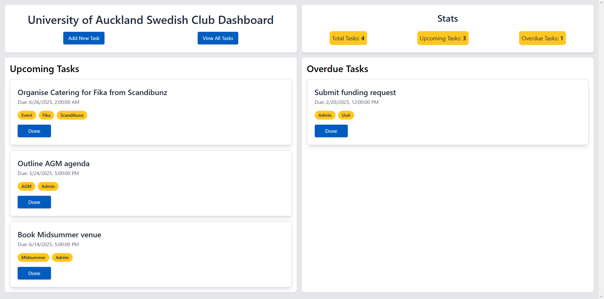
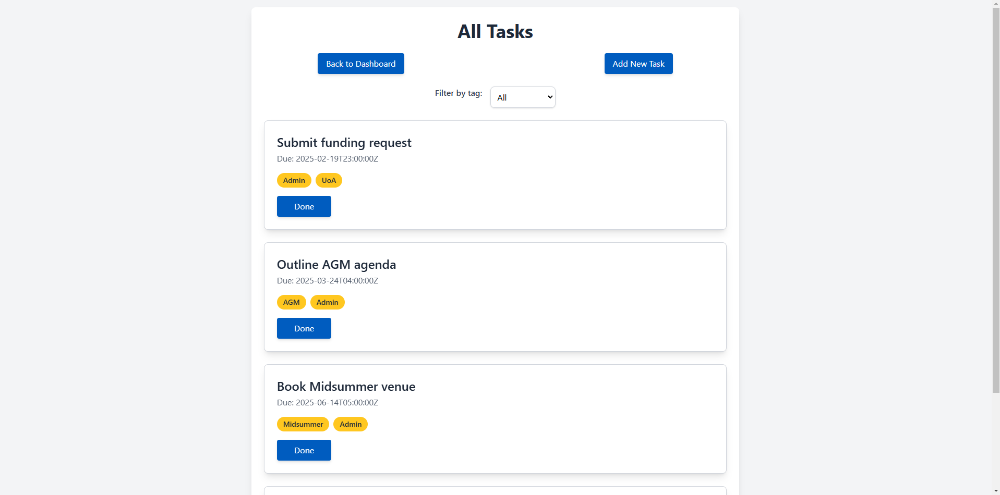
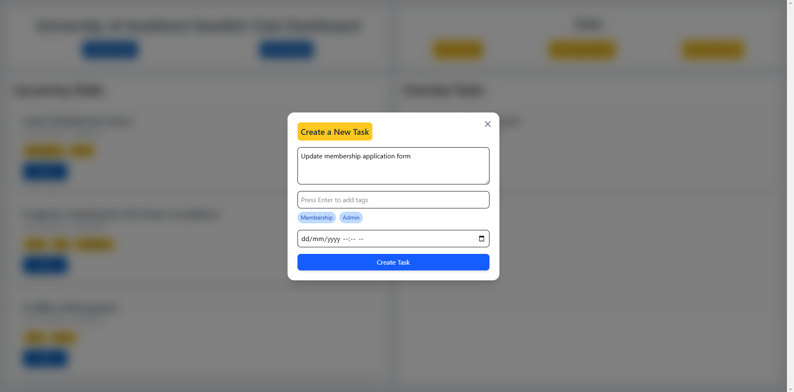

# Swedish Club Management Dashboard

Welcome to the Swedish Club Management Dashboard! This project serves as a vital tool for club executives, enhancing their ability to manage tasks related to the University of Auckland's Swedish Club. With a focus on efficiency and usability, it showcases my skills in backend development and API integration through a fully custom RESTful API and an intuitive front-end interface.

## Project Overview

The Swedish Club Management Dashboard is a web application tailored for club executives, enabling them to efficiently organize, view, and manage their tasks. This project emphasizes practical usability, allowing club members to seamlessly coordinate their activities and stay engaged with their responsibilities. By streamlining task management, it fosters a more organized and productive club environment.

## Features

- **Task Management**: Effortlessly create, view, and delete tasks.  
  

- **Overdue Task Highlighting**: Instantly spot overdue tasks to facilitate timely action.  
  

- **Custom API**: A fully custom RESTful API enabling efficient interaction with task data.  
  

- **User-friendly Interface**: A clean, intuitive layout that reflects Swedish cultural aesthetics.

## Technologies Used

- **Frontend**: HTML, CSS, JavaScript (with a focus on responsive design)
- **Backend**: Node.js, Express.js
- **Database**: In-memory data storage (with future plans for SQL implementation)
- **Hosting**: Backend hosted on Render.com

## Usage

Upon accessing the dashboard, club executives can view an overview of tasks, including overdue items. The "Quick Add Task" button opens a user-friendly popup for adding new tasks, while the interface allows filtering by tags and due dates, enhancing overall task management.

## Contributing

Contributions are welcome! If you have suggestions for improvements or wish to report any issues, please feel free to open an issue or submit a pull request.
